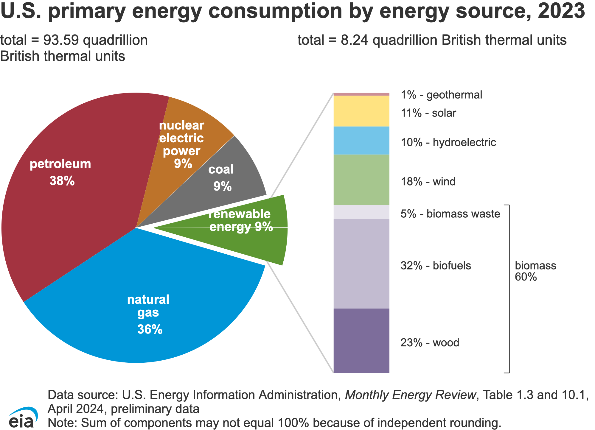

\newpage

# Part 1: Introduction

As climate crisis becomes a severe concern nowadays, decreasing energy consumption and the greenhouse effect is very urgent. It is important to examine the energy we consume and reduce its use. However, renewable energy is a type of energy that we want use it more frequently and replace other energy sources with.

### What is Renewable Energy?

Renewable energy is derived from natural sources that are replenished at a rate faster than they are consumed. Such natural resources include sunlight, wind, and tides. These resources can be harnessed and converted into useful energy forms such as electricity, heat, and fuel. Some examples of renewable energy include hydroelectric power, geothermal energy, solar energy, wind energy, and biomass energy (wood energy, waste energy, biofuels).

### Why is Renewable Energy Important?

Renewable energy typically emits lower levels of greenhouse gases, contributing to a reduction in carbon emissions. Utilizing renewable energy helps to address climate change. Therefore, increasing the use of renewable energy is beneficial.

### What am I Trying to Do?

While many researchers have previously developed models to predict future trends in total renewable energy consumption, I aim to take a deeper look by applying various models, including linear regression, random forest, elastic net, and K-Nearest Neighbors. The models will be trained on the available data and tested for accuracy on a separate testing dataset. My goal is to evaluate which model is most effective in predicting future trends in total renewable energy consumption by using past years renewable energy records from different sectors.

# Part 2: Exploratory Data Analysis

This dataset was found on Kaggle and is called "U.S. Renewable Energy Consumption." It shows monthly data on renewable energy consumption in the United States, from January 1973 to December 2024, categorized by energy source and consumption sector. It is obtained from: https://www.kaggle.com/datasets/alistairking/renewable-energy-consumption-in-the-u-s?resource=download The original data is sourced from the U.S. Energy Information Administration (EIA).

```{r, echo = F, message = F}
library(readr)
library(tidyverse)
library(tidymodels)
library(tidyr)
library(recipes)
library(ggplot2)
library(kknn)
library(glmnet)
library(ranger)
library(janitor) # for clean_names()
library(naniar) # for missing datat vis_miss()
library(patchwork) # for putting plots together
library(yardstick)

data <- read_csv("dataset.csv")
head(data, 10)

data_dim <- dim(data)
data_dim
```

There are a total of 3,065 observations and 17 variables.

Variables: - `Year`: Calendar Year. - `Month`: Month number (1-12). - `Sector`: The energy consumption sector (Commercial, Electric Power, Industrial, Residential, or Transportation). - `Hydroelectric Power`: Hydroelectric power consumption in the given sector and month, in trillion BTUs. - `Geothermal Energy`: Geothermal energy consumption in the given sector and month, in trillion BTUs. - `Solar Energy`: Solar energy consumption in the given sector and month, in trillion BTUs. - `Wind Energy`: Wind energy consumption in the given sector and month, in trillion BTUs. - `Wood Energy`: Wood energy consumption in the given sector and month, in trillion BTUs. - `Waste Energy`: Waste energy consumption in the given sector and month, in trillion BTUs. - `Fuel Ethanol, Excluding Denaturant`: Fuel ethanol (excluding denaturant) consumption in the given sector and month, in trillion BTUs. - `Biomass Losses and Co-products`: Biomass losses and co-products in the given sector and month, in trillion BTUs. - `Biomass Energy`: Total biomass energy consumption (sum of wood, waste, ethanol, and losses/co-products) in the given sector and month, in trillion BTUs. - `Total Renewable Energy`: Total renewable energy consumption (sum of hydroelectric, geothermal, solar, wind, and biomass) in the given sector and month, in trillion BTUs. - `Renewable Diesel Fuel`: Renewable diesel fuel consumption in the given sector and month, in trillion BTUs. - `Other Biofuels`: Other biofuels consumption in the given sector and month, in trillion BTUs. - `Conventional Hydroelectric Power`: Conventional hydroelectric power consumption in the given sector and month, in trillion BTUs. - `Biodiesel`: Biodiesel consumption in the given sector and month, in trillion BTUs.

## Data Cleaning

First, I am going to clean the data based on research purpose.


{width="400"}


According to this pie chart from the EIA, I decided to mainly focus on five renewable energy sources: biomass energy (including biomass waste, biofuels, and wood), wind energy, hydroelectric power, solar energy, and geothermal energy.

Thus, the continuous variable I will be working with are "Hydroelectric Power," "Geothermal Energy," "Solar Energy," "Wind Energy," "Biomass Energy," and "Year." The "Biomass Energy" in this dataset is a sum of wood, waste, ethanol, and losses/co-products. The categorical predictors I will use are "Month" and "Sector". "Year" is consider as continuous because I want to model the trend over time. "Month" is consider as categorical because I want to capture the seasonal difference within a year. Lastly, my response variable will be "Total Renewable Energy."

In addition, according to the author, Alistair King, every entry with a value of 0 indicates that the data point was either 'Not Available,' 'No Data Reported,' or 'Not Meaningful.' Therefore, I will also use filters to exclude missing values. I will also applied function to make all column names consistent.

```{r}
energy_data <- data %>% 
  clean_names() %>% 
  select(year, month, sector, biomass_energy, wind_energy, hydroelectric_power, solar_energy, geothermal_energy, total_renewable_energy) %>%
  filter(biomass_energy !=0, wind_energy != 0, hydroelectric_power != 0, solar_energy!= 0, geothermal_energy != 0, total_renewable_energy != 0) %>% 
  mutate(year = as.numeric(year), sector = as.factor(sector), month = as.factor(month))
  
head(energy_data, 10)
dim(energy_data)
range(energy_data$year)
```

Now the dataset has 317 observations and 9 variables. And due to data availability, the range of years was adjusted to 2010 to 2024.

## Data Visualization

Now, I want to continue tidying the data by producing plots for visualization.

### Distribution of Continuous Variables

First, let's examine the distribution of our continuous energy consumption variables.

```{r}
p1 <- energy_data %>% ggplot() +
  geom_histogram(aes(x = total_renewable_energy), fill = "skyblue") + theme_bw()

p2 <- energy_data %>% ggplot()+
  geom_histogram(aes(x = biomass_energy,), fill = "lightpink") + theme_bw()

p3 <- energy_data %>% ggplot()+
  geom_histogram(aes(x = solar_energy), fill = "gold") + theme_bw()

p4 <- energy_data %>% ggplot() +
  geom_histogram(aes(x = hydroelectric_power), fill = "lightgreen") + theme_bw()

p5 <- energy_data %>% ggplot() +
  geom_histogram(aes(x = wind_energy), fill = "royalblue") + theme_bw()

p6 <- energy_data %>% ggplot() +
  geom_histogram(aes(x = geothermal_energy), fill = "palevioletred") + theme_bw()

p1 + p2 + p3 + p4 + p5 + p6 +
  plot_layout(ncol = 3)
```

The x-axis represents renewable energy consumption in trillion BTUs, and the y-axis represents the frequency. We need to be careful when comparing across different plots. The plots in the first row have an x-axis range a lot larger than the plot in the second row, which range from 0 to not over 3. However, this does not mean the range is small, because the unit is in trillions.

The distribution of the outcome variable "Total Renewable Energy" shows a peak frequency around 15, with another high frequency around 200. There is a large gap between these two values, probably due to the removal of missing values, as it removes entire rows.

### Distribution of Outcome Variables over Years

```{r}
p1_year <- energy_data %>%
  ggplot(aes(x = year, y = total_renewable_energy)) +
  geom_col(fill = "skyblue") +
  theme_bw() +
  labs(title = "Total Renewable Energy Consumption Over Time",
       x = "Year", y = "Total Renewable Energy")
p1_year
```

The distribution of the outcome variable "Total Renewable Energy" appears steady from 2011 to 2023, with two notable drops in 2010 and 2024. The drops could be due to missing data for 2011 and the year of 2024 has not end yet. Therefore, I will drop the year 2010 and 2024.

```{r}
energy_data <- energy_data %>% filter(!(year %in% c(2010, 2024)))
dim(energy_data)
```

Now the dataset has only 303 observations and 9 variables includes the response variables.

### Scatterplots of Outcome Variable over Years By Sector

```{r}
ggplot(energy_data, aes(x = year, y = total_renewable_energy, color = sector)) +
  geom_point() +
  geom_smooth(method = "lm", se = FALSE) +
  labs(title = "Total Renewable Energy Over the Years by Sector",
       x = "Year",
       y = "Total Renewable Energy (Trillion BTUs)") +
  theme_minimal()
```

Wow, it is a good thing I made the scatter plot of total renewable energy over the years by sector! Otherwise, I would never know that only two sectors have values across all five renewable energy sources. I'm curious why that is. After taking a closer look at the dataset, it makes sense, for example, the electric power sector is missing hydroelectric power. However, my goal is to see how the five renewable energy sources contribute, so I will leave the dataset as it is and adjust my research question to focus on just the Commercial and Industrial sectors.

For the scatter plot, we can see that the total renewable energy in the industrial sector is slightly decreasing over the years, while the commercial sector shows a slight increasing trend. However, industrial sector consumed a lot more than commercial sector.

### Correlation Plot

Now, let's explore the overall relationships between all of the continuous, non-missing variables using a correlation plot.

```{r}
library(corrplot)
numeric_correlation <- energy_data %>%
  select(where(is.numeric)) %>% 
  cor() %>% 
  corrplot(type = "lower", tl.cex = 0.5, mar = c(0, 0, 0, 0))
```

From the correlation plot, we can see that total renewable energy has a strong relationship with all variables except year and wind energy. We want our response variable to be highly correlated with other variables, so this looks good.

Geothermal and biomass energy are also highly negatively correlated with each other. One possible reason for this could be that geothermal energy is more feasible in areas with geothermal activity, while biomass energy is more feasible in large agricultural areas. Wind energy is not very correlated with any other variables. And I will use regularization methods and standardization to reduce the impact of multicollinearity.

# Part 3: Data Spliting and Cross-Validation

Now let's prepare our data for model fitting.

## Data Spliting

Although the dataset is small, I will begin by splitting it into training and testing datasets. I will fit our model on the training data and then evaluate the best model on the testing data to see how it performs on the new and unseen data. This approach helps avoid over-fitting because the model is not fitted to all the data. I will split the dataset into 70% training data and 30% testing data. In addition, the split will stratify by the outcome variable, total renewable energy.

```{r}
set.seed(123)

data_split <- initial_split(energy_data, prop = 0.7, strata = total_renewable_energy)

data_train <- training(data_split)
data_test <- testing(data_split)

nrow(data_train)
nrow(data_test)
```

We have 211 training data and 92 testing data.

## Reciept Creating

Now, I will create a universal recipe to use for all of our models later.

Similar as mentioned before, I am going to use 8 predictors: "Hydroelectric Power," "Geothermal Energy," "Solar Energy," "Wind Energy," "Biomass Energy," "Conventional Hydroelectric Power," "Year," and "Month." Then I will dummy all categorical variabls such as month and sector. I will also standardize (center and scale) all predictors. And then we can view the dataset by using prep and bake.

```{r}
energy_recipe <- recipe(total_renewable_energy ~ year  + month + sector + hydroelectric_power + geothermal_energy + solar_energy + wind_energy + biomass_energy, data_train) %>%
  step_dummy(all_nominal_predictors()) %>% 
  step_center(all_predictors()) %>% 
  step_scale(all_predictors())

prep(energy_recipe) %>%
  bake(new_data = data_train) %>%
  head(10)
```

## K-Fold Cross-Validation

K-Fold Cross-Validation is a strategy we can use to ensure a more reliable estimate of the model's performance across multiple subsets. Since my dataset is small, I am going to use 10-Fold Cross-Validation, which means each fold will use 90%, which is (k-1)%, of the data for training and 10% for testing. The average result from testing of each fold will be used to measure the performance of our model.

```{r}
energy_folds <- vfold_cv(data_train, v = 10, strata = total_renewable_energy)
energy_folds
```

# Part 4: Model Fitting

## Model Building

It's time to fit models to our data!

First, we are going to set up different models and the workflows. We will specify the mode, the engine, and the parameters we want to use to tune. And in the workflow we will add the model and recipe.

```{r}
# Linear regression
lm_mod <- linear_reg() %>%
  set_engine("lm")

lm_workflow <- workflow() %>%
  add_recipe(energy_recipe) %>%
  add_model(lm_mod)

# K Nearest Neighbors
knn_mod <- nearest_neighbor(neighbors = tune()) %>%
  set_engine("kknn") %>%
  set_mode("regression")

knn_workflow <- workflow() %>% 
  add_model(knn_mod) %>% 
  add_recipe(energy_recipe)

# Elastic Net
en_mod <- linear_reg(mixture = tune(), penalty = tune()) %>%
  set_mode("regression") %>%
  set_engine("glmnet")

en_workflow <- workflow() %>% 
  add_model(en_mod) %>% 
  add_recipe(energy_recipe)

# Random Forest
rf_mod <- rand_forest(mtry = tune(), trees = tune(), min_n = tune()) %>% 
  set_engine("ranger", importance = "impurity") %>% 
  set_mode("regression")

rf_workflow <- workflow() %>% 
  add_recipe(energy_recipe) %>% 
  add_model(rf_mod)
```

Next, we are going to create tuning grid to specify the ranges of the parameters.

```{r}
# Linear regression
# Linear regression do not have tuning parameters

# KNN
knn_grid <- grid_regular(neighbors(range = c(1, 15)), levels = 5)
knn_grid

# Elastic Net
en_grid <- grid_regular(penalty(range = c(0, 1), trans = identity_trans()), mixture(range = c(0, 1)), levels = 10)
en_grid

# Random Forest
rf_grid <- grid_regular(mtry(range = c(1, 6)), 
                        trees(range = c(200, 600)),
                        min_n(range = c(10, 20)),
                        levels = 5)
rf_grid
```

Now we can tune the model by specifying workflow, folds, and grid.

```{r}
# Linear regression
# No tuning

# KNN
knn_tune <- tune_grid(object = knn_workflow, resamples = energy_folds , grid = knn_grid)
knn_tune

# Elastic Net
# elastic_tune <- tune_grid(object = en_workflow, resamples = energy_folds, grid = en_grid)

# Random Forest
# rf_tune <- tune_grid(object = rf_workflow, resamples = energy_folds, grid = rf_grid)
```

Since building model is very time consuming, we can save the results to an RDA file and load it when needed.

```{r}
# save(elastic_tune, file = "elastic_tune.rda")
load("elastic_tune.rda")
elastic_tune

# save(rf_tune, file = "rf_tune.rda")
load("rf_tune.rda")
rf_tune
```

## Model Results

Lastly, we will collect the metrics and compare the performance of each model:

### RMSE

```{r}
# Linear Regression
# We will fit linear regression to the folds because it does not have grid
lm_fit <- fit_resamples(lm_workflow, resamples = energy_folds)

lm_metrics <- collect_metrics(lm_fit) %>%
  filter(.metric == "rmse") %>% 
  slice_min(order_by = mean)
lm_metrics

# KNN
knn_metrics <- collect_metrics(knn_tune) %>% 
  filter(.metric == "rmse") %>% 
  slice_min(order_by = mean)
knn_metrics

# Elastic Net
elastic_metrics <- collect_metrics(elastic_tune) %>%
  filter(.metric == "rmse") %>% 
  slice_min(order_by = mean)
elastic_metrics

# We will select the best elastic_metrics
simple_elastic <- elastic_metrics %>%
  slice(1)
simple_elastic

# Random Forest
rf_metrics <- collect_metrics(rf_tune) %>% 
  filter(.metric == "rmse") %>% 
  slice_min(order_by = mean)
rf_metrics

metrics_table <- tibble(Model = c("Linear Regression", "K Nearest Neighbors", "Elastic Net", "Random Forest"), RMSE = c(lm_metrics$mean, knn_metrics$mean, simple_elastic$mean, rf_metrics$mean))
metrics_table
```

The Linear Regression model has the lowest RMSE, indicating it fits the data with the highest precision. It also indicates that our data set is probably linear. In contrast, K Nearest Neighbors shows the highest RMSE, suggesting it performs the worst in predicting the outcome.

### Model Autoplots

Autoplot for elastic net:

```{r}
autoplot(elastic_tune, metric = 'rmse') + theme_minimal()
```

We want to choose the model with the lowest RMSE. In this graph, it will be the purple line at the very bottom, which corresponds to the model with a lasso penalty proportion (mixture) equal to 1 and has a constant amount of regularization (penalty). 

Autoplot for random forest:

```{r}
autoplot(rf_tune, metric = 'rmse') + theme_minimal()
```

In random forest model, we tuned 3 different parameters: - mtry: number of predictors to try at each split - trees: number of trees in the forest - min_n: minimum number of data points required at a node to continue splitting

And we set the The levels = 5 means that 5 different values (levels) will be chosen across the range for each hyperparameter.

From the autoplot of the Random Forest, we can see that the number of trees has little impact on the result, as all the lines are almost on top of each other. Minimal node size also does not have a large impact. The number of predictors has the greatest impact on the RMSE result, and it seems like using 6 predictors will return us the lowest RMSE value.

Congrats! The best model is just linear regression model 'Preprocessor1_Model11'!!

# Part 5: Model Selection and Performance

Now, let's fit our best model to the training data then we can evaluate its performance on testing data.

```{r}
final_lm_model <- lm(total_renewable_energy ~., data = data_train)

# predict on testing data
lm_predict <- predict(final_lm_model, newdata = data_test)

# create data frame
lm_predictions <- data.frame(.pred = lm_predict, truth = data_test$total_renewable_energy)

metrics <- metric_set(rsq, rmse, mae)
metrics(lm_predictions, truth = truth, estimate = .pred)
```

The linear regression model has a R\^2 0.9999999999, RMSE 0.0007450944 and MAE 0.0005894985. The R\^2 0.9999999999 means 99.9% of variation in total renewable energy can be explained by all selected independent variables. The model has a very high R\^2, very low RMSE and MAE, which is almost a perfect model!

Let's also plot the predicted values versus the actual values:

```{r}
ggplot(lm_predictions, aes(x = .pred, y = truth)) +
  geom_point() +
  geom_abline(color = "red", linetype = "dashed") +
  labs(title = "Predicted vs Actual Values",
       x = "Predicted Values",
       y = "Actual Values") +
  theme_minimal()
```

Since the dashed line represents perfect predictions and all of our observations fall on this dashed line, our model is performing very well.

Again, since the original dataset is very straightforward and tend to be linear, our model is performing very well.

# Part 6: Conclusion

In this project, we fitted four different models: Linear Regression, K-Nearest Neighbors (KNN), Elastic Net, and Random Forest. The best model was the Linear Regression model, which is not surprising and indicates that our data is quite straightforward, so the Linear Regression model fits almost perfectly. The K-Nearest Neighbors model performed worse because KNN is better suited for capturing complex and non-linear relationships. In addition, KNN typically requires a larger dataset, and our dataset is too small.

If I continue this project in the future, I would like to make my research proposal more detailed by focusing on all sector seperately. Currently, my final model only fitted data for 2 sectors because sectors such as electric power do not have data on hydroelectric power, and I removed all rows with NA values. Therefore, if I want to find out the difference of total renewable energy change over year between each sector, I should fit the model to data from five different sectors seperately.

In conclusion, the Linear Regression model best predicts future trends in total renewable energy consumption based on past records of renewable energy sources (Hydroelectric Power, Geothermal Energy, Solar Energy, Wind Energy, Biomass Energy) from different sectors (Commercial, Industrial). This is a positive indicator, suggesting that we are continually increasing our use of total renewable energy over the years and in the future. As mentioned before, increasing the use of renewable energy helps reduce greenhouse gas effects and global warming. However, the climate crisis continues, and we should continue to make more positive changes to protect our environment.

# Data Source

This dataset was found on Kaggle and is called "U.S. Renewable Energy Consumption" by Alistair King: https://www.kaggle.com/datasets/alistairking/renewable-energy-consumption-in-the-u-s?resource=download The original source for this dataset is from the U.S. Energy Information Administration (EIA).

The figure 'U.S. Primary Energy Consumption by Energy Source, 2023' is taken from: https://www.eia.gov/energyexplained/us-energy-facts/
